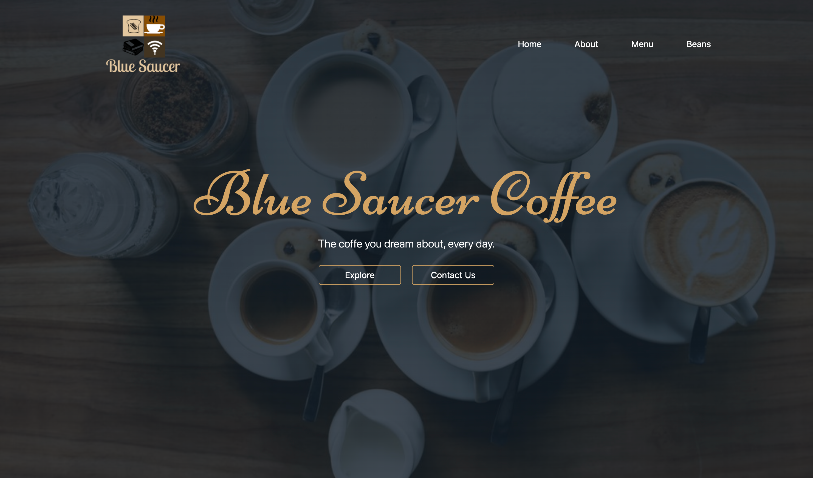
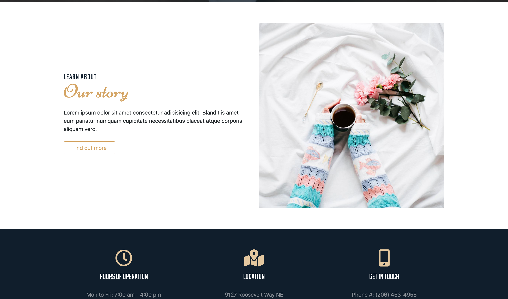
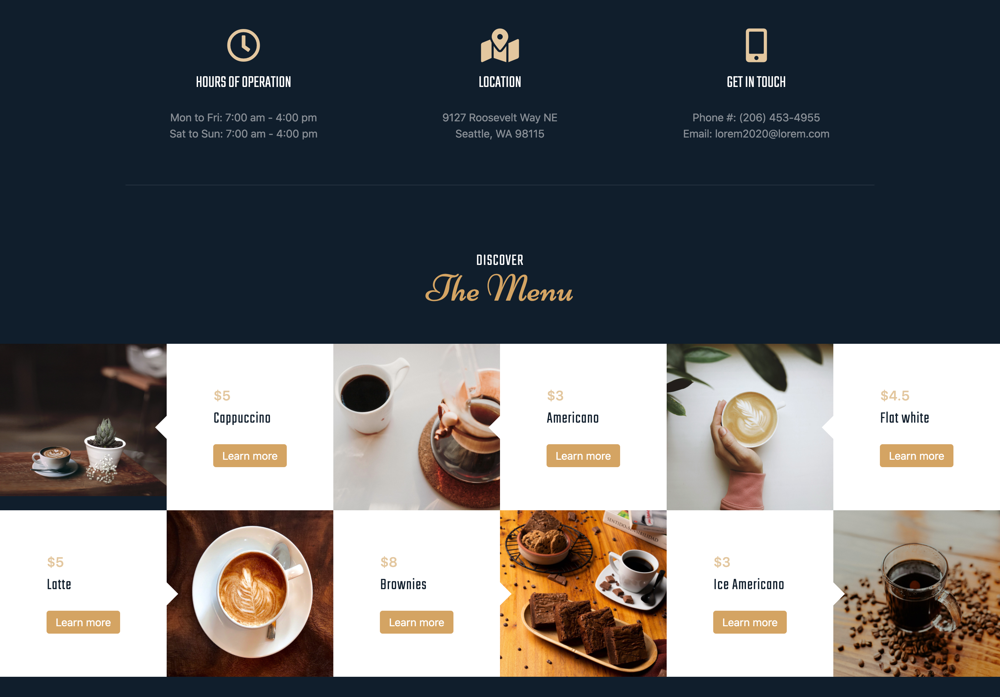
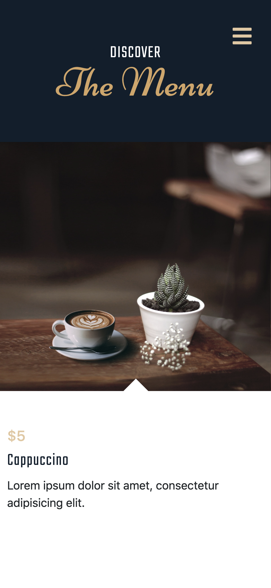
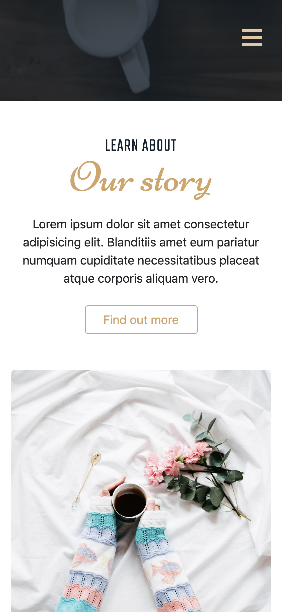

# Coffee Shop Landing Page

### Main technolodges: Sass, Bootstrap, HTML5, CSS3

**Features:**
- Moble First Design
- Custom Navbar, Button effects, etc.

---

[Live page](https://hyhong-code.github.io/blue-saucer-cafe-frontend/)

## SHOWCASE:

### Small Device:

